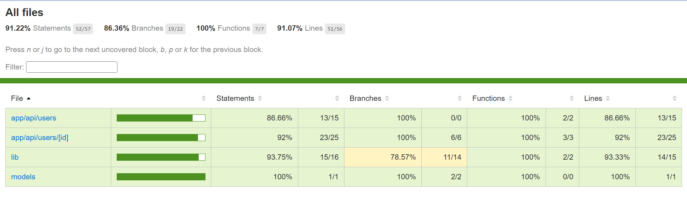
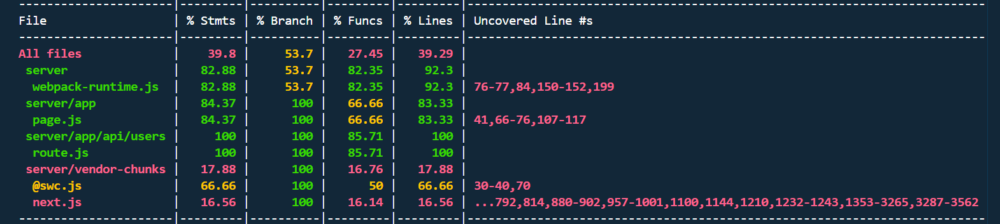

# 🔐 User Manager – Custom API Server with MongoDB and Next.js

This is a fullstack CRUD app built using **Next.js (App Router)** and **MongoDB Atlas**. It includes:

* REST API endpoints for user management
* Integrated database using Mongoose
* Fully tested with **Jest** and **Supertest** for unit, integration, and mocked API tests

---

## 📌 APIs Created & Their Functionality

| Method | Endpoint        | Description       |
| ------ | --------------- | ----------------- |
| GET    | /api/users      | Get all users     |
| POST   | /api/users      | Create a new user |
| GET    | /api/users/\:id | Get user by ID    |
| PUT    | /api/users/\:id | Update user by ID |
| DELETE | /api/users/\:id | Delete user by ID |

---

## 🛠️ Tech Stack

* **Framework**: Next.js (App Router)
* **Database**: MongoDB Atlas
* **ODM**: Mongoose
* **Testing**: Jest, Supertest, mongodb-memory-server

---

## 🤝 How to Run the App

```bash
# 1. Clone the repo
https://github.com/harshpdsingh/custom-api-server.git
cd custom-api-server

# 2. Install dependencies
npm install

# 3. Create a .env.local file and add:
MONGODB_URI=your-mongodb-uri

# 4. Start the development server
npm run dev
```

Visit: `http://localhost:3000`

---

## 💻 Frontend UI

> Integrated inside Next.js app

* Form to **Create User**
* Table to **View/Edit/Delete Users**

---

## 🔢 API Examples

### POST /api/users

```json
{
  "name": "Harsh",
  "email": "harsh@example.com"
}
```

### PUT /api/users/\:id

```json
{
  "name": "Updated Harsh",
  "email": "updated@example.com"
}
```

### DELETE /api/users/\:id

No body required.

### Test with curl:

```bash
curl -X POST http://localhost:3000/api/users \
  -H "Content-Type: application/json" \
  -d '{"name":"Harsh","email":"harsh@example.com"}'
```

---

## 🔮 How to Run Tests

```bash
# Run all tests
npm run test

# Run tests with coverage
npm run test:coverage
```

---

## 🌟 Testing Frameworks Used

* **Jest**: Testing framework
* **Supertest**: HTTP assertions
* **mongodb-m<<<<<<< HEAD
## 🌟 Testing Frameworks Used

* **Jest**: Testing framework
* **Supertest**: HTTP assertions
* **mongodb-memory-server**: In-memory MongoDB for integration tests

---

## 🔍 What Is Tested?

### ✅ Unit Tests:

* Database connection logic (`lib/db.js`)
* User model logic (`models/User.js`)

### ✅ Integration Tests:

* CRUD operations with real database (in-memory)
* User flow end-to-end

### ✅ API Route Tests (mocked + non-mocked):

* POST /api/users
* GET /api/users
* PUT /api/users/\:id
* DELETE /api/users/\:id
* GET /api/users/\:id

---

## 📊 Test Coverage Screenshot




---

## 👤 Author

**Harsh Prasad Singh**
Built with 💻 Next.js, ❤️ MongoDB, and ✨ love for clean code and testing!

---


## Keploy API Testing Integration

This project uses **Keploy** (v2.6.14) for AI-powered API test generation and execution.

### ✅ Keploy Setup & Execution

1. **Install Keploy (if not already):**

   ```bash
   curl --silent --location "https://dl.keploy.io/linux/install.sh" | bash
   ```

2. **Run in Record Mode:**

   This captures real API traffic during manual testing.

   ```bash
   sudo -E keploy record -c "npm run dev" --record-timer 2m
   ```

   - `--record-timer 2m`: Runs for 2 minutes while you manually hit endpoints (e.g., using Postman).
   - Generated tests will be saved in `keploy/test-set-0/`.

3. **Run in Test Mode:**

   This replays the recorded test cases and validates responses.

   ```bash
   sudo -E keploy test -c "npm run dev" --delay 25
   ```

   - `--delay 25`: Gives the app 25 seconds to start before testing begins.

---

### 📄 Test Coverage Report

After testing, Keploy generates a **coverage.txt** file inside the root directory. This includes:

- Total tests run
- Number of passed/failed tests
- Header mismatches (like ETag or Date)
- Missing responses or timeouts

> **Note:** ETag-related test failures were resolved by marking dynamic headers as global noise using `--global-header` or inside the config.

---

### 🧠 Intelligent Features Used

- **Test case generation from real user traffic** (via `record` mode)
- **Noise filtering of unstable headers**
- **Automatic mocking of dependencies (like MongoDB)**

---

### 📸 Keploy Test Coverage Screenshot



---

### 📁 Generated Files by Keploy

- `keploy/test-set-0/`: Captured test cases
- `keploy/mocks/`: Auto-generated dependency mocks
- `coverage.txt`: Optional text report if `--coverage-report-path` is used

---

### 🔗 Resources

- [Keploy Docs](https://docs.keploy.io/)
- [OpenAPI Schema Used](./openapi.yaml)


## 📜 License

[](./UNLICENSE)

